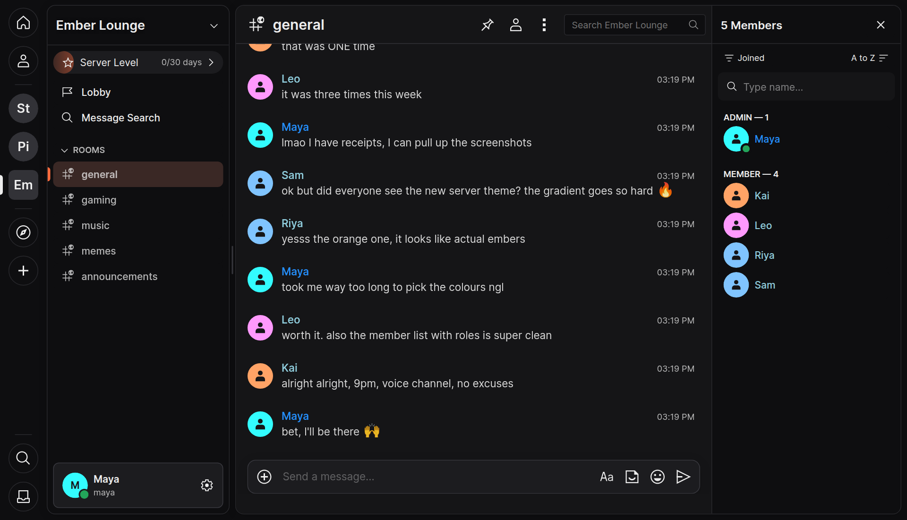

<p align="center">
  
</p>

# Angaara

Your communities, on an open network. Angaara is a Matrix chat app built around servers,
channels and friends, with end-to-end encryption, server levels, bots with rich embeds and slash
commands, and a built-in developer portal for building your own.

- [Open Angaara](https://angaara.app)
- [Terms](https://angaara.app/terms.html)
- [Bot SDK](bot-sdk/)

> [!WARNING]
> The phone layout is in beta. Some things, like swiping between panels, are still being
> polished.



## Developing

```sh
npm ci          # install
npm start       # dev server
npm run build   # production build into dist/
```

The default homeservers, featured communities and welcome screen servers are set in
[`config.json`](config.json).

## License

Angaara is a fork of [Cinny](https://github.com/cinnyapp/cinny) and is licensed under
AGPL-3.0-only, like Cinny.

Cinny Project  
Copyright © 2024–present Ajay Bura  
https://cinny.in  

Cinny is licensed under the GNU Affero General Public License, 
Version 3 of the License (AGPL-3.0-only).
You may obtain a copy of the License at https://www.gnu.org/licenses/agpl-3.0.html